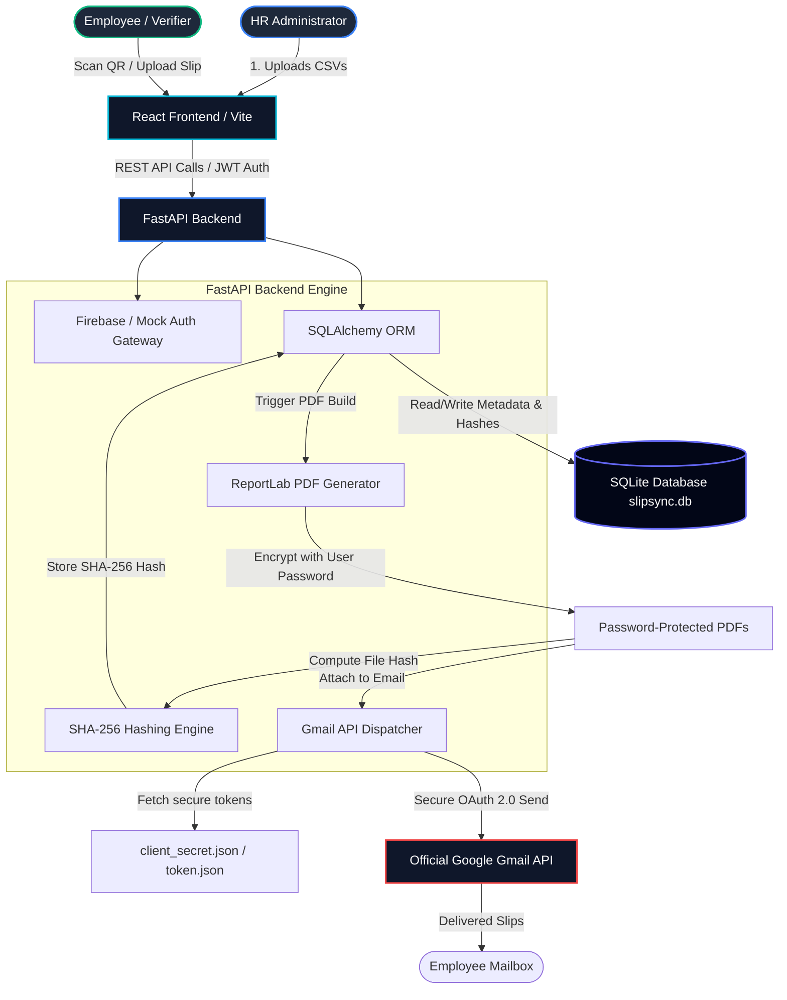

# 📄 Slip-Sync: Enterprise-Grade Cryptographic Payroll Engine

<div align="center">
  
  
  <p><strong>A secure, end-to-end automated payroll processing, PDF salary slip encryption, and Google Gmail API dispatch system with cryptographic authenticity verification.</strong></p>

  [](https://www.python.org/)
  [](https://react.dev/)
  [](https://fastapi.tiangolo.com/)
  [](https://www.docker.com/)
  [](https://kubernetes.io/)
  [](LICENSE)
</div>

---

## 🌟 Executive Summary

**Slip-Sync** is a highly secure, modern web application designed for enterprise HR departments to automate bulk payroll distribution. 

By simply uploading two standard corporate CSV files (representing staff profiles and their monthly payroll calculations), Slip-Sync:
1. **Generates beautiful, professional PDF salary slips** with detailed earnings/deductions breakdowns.
2. **Secures every PDF dynamically** using employee-specific cryptographic passwords.
3. **Hashes every document using SHA-256** and registers it on a secure local ledger.
4. **Dispatches slips automatically** to each employee's mailbox using the official **Google Gmail API** (OAuth 2.0).
5. **Enables instantaneous authenticity verification** via QR-code scan or portal upload—preventing salary slip tampering, forgery, or fraud.

---

## 🏗️ System Architecture

Slip-Sync follows a modern, decoupled client-server architecture. Below is the workflow depicting how data is processed, secured, sent, and cryptographically verified.



---

## ✨ Key Features

*   **⚡ Automated Bulk Processing**: Instantly ingests hundreds of employee payroll records in seconds.
*   **🔒 Double-Layer PDF Security**: PDFs are compiled programmatically using ReportLab, then encrypted using PyPDF2 using a dynamic password formula combining the employee's name and ID.
*   **🛡️ Cryptographic Tamper-Proof Verification**: Slips include a cryptographic signature. Anyone with access to the PDF (e.g., banks, landlords, auditors) can scan the QR code or upload the PDF to the verification portal. The system re-computes the document's SHA-256 hash and validates it against the secure database ledger to confirm authenticity.
*   **📧 Google Workspace Gmail Integration**: Avoid spam folders by sending emails directly through your corporate Gmail/Google Workspace account using secure OAuth 2.0 authentication.
*   **📊 Live Dispatch Dashboard**: A real-time tracker tracking email statuses: *Pending*, *Sending*, *Delivered*, and *Failed*, with detailed error logs for failure debugging.
*   **🏢 Multi-Tenant Admin Isolation**: Admin users get dynamically created workspaces isolated by their email/company domain. One company's HR cannot see or manage another company's records.

---

## 🛠️ Technology Stack

| Layer | Technologies Used | Description |
| :--- | :--- | :--- |
| **Frontend** | React 18, TypeScript, Vite, Tailwind CSS, Framer Motion, Lucide React | Modern SPA with rich interactive panels, glassmorphic UI, animations, and charts. |
| **Backend** | Python 3.12, FastAPI, SQLAlchemy ORM, Pandas | High-performance asynchronous REST API, data validation, and processing pipeline. |
| **Document Processing** | ReportLab, PyPDF2 | PDF generation with embedded QR codes, dynamic flowable tables, and standard RC4/AES PDF encryption. |
| **Database** | SQLite (with SQLAlchemy) | Lightweight, robust relational storage for transactional data and document hashes. |
| **Authentication** | Firebase Admin SDK + JWT Mock Fallback | Production-grade Google Firebase auth with a zero-setup local developer mock mode. |
| **Integrations** | Google API Client, Google Auth OAuthlib | Secured credential handshake and OAuth 2.0 SMTP-less email sending. |
| **Containerization** | Docker, Docker Compose | Clean service multi-container orchestration. |
| **Orchestration** | Kubernetes (K8s) | Scalable production deployment manifests with PVC storage persistence. |

---

## 📂 Project Structure

```bash
slip-sync/
├── backend/                   # Python FastAPI Application
│   ├── uploads/               # Dynamic directory holding processed PDF slips (Ignored by Git)
│   ├── main.py                # Core REST API entrypoint and routes
│   ├── database.py            # SQLite session management & DB engines
│   ├── models.py              # SQLAlchemy Schema Models (User, Company, Employee, Salary, Slip)
│   ├── pdf_generator.py       # ReportLab payroll PDF styling & PyPDF2 encryption engine
│   ├── email_worker.py        # Asynchronous Gmail sender utilizing OAuth 2.0 token
│   ├── setup_gmail.py         # Google API authorization flow utility script
│   ├── firebase_config.py     # Firebase authentication gate & mock session fallback
│   ├── Dockerfile             # Production container setup for Python backend
│   └── requirements.txt       # Python backend package dependencies
├── frontend/                  # React Vite Client
│   ├── src/
│   │   ├── components/        # Frontend pages (Dashboard, Verify, EmployeePortal, Login)
│   │   ├── lib/               # Utilities (Firebase SDK init, axios API clients)
│   │   ├── App.tsx            # Route handling & navigation
│   │   └── index.css          # Tailwind and global layout styles
│   ├── public/                # Static assets (Favicons, SVG icons)
│   ├── Dockerfile             # Multi-stage production Nginx/Vite container setup
│   └── package.json           # Frontend Node modules and scripts
├── k8s/                       # Kubernetes deployment manifests
│   ├── backend-deployment.yaml
│   ├── backend-service.yaml
│   ├── backend-pvc.yaml       # Persistent Volume Claim for SQLite slipsync.db & tokens
│   ├── frontend-deployment.yaml
│   └── frontend-service.yaml
├── docker-compose.yml         # Local orchestration of frontend, backend, and volume mounts
├── employees_data.csv         # Staff profile database template
├── payroll_data.csv           # Salary calculations template
└── .gitignore                 # Deep-layered system file protection rules
```

---

## 📊 CSV Input Specifications

To successfully process payroll, the system expects two CSV files uploaded through the administrator dashboard. Both files are joined using the **Employee ID** column.

### 1. Employee Data (`employees_data.csv`)
Defines the corporate staff database.

| Column Header | Data Type | Required | Description | Example |
| :--- | :--- | :--- | :--- | :--- |
| **Employee ID** | String | **Yes** | Unique primary identifier for the staff member | `NT-0104` |
| **Name** | String | **Yes** | Employee's full name (used in slips and PDF passwords) | `Rahul Reddy` |
| **Email** | String | **Yes** | Official employee email (where the salary slip is dispatched) | `rahul.reddy@acme.com` |
| **Designation** | String | **Yes** | Corporate job title printed on the salary slip | `Admin Manager` |

*Example:*
```csv
Employee ID,Name,Email,Designation
NT-0104,Rahul Reddy,rahul.reddy@acme.com,Admin Manager
```

### 2. Payroll Data (`payroll_data.csv`)
Defines the breakdown of salary components for a specific billing cycle.

| Column Header | Data Type | Required | Description | Example |
| :--- | :--- | :--- | :--- | :--- |
| **Employee ID** | String | **Yes** | Foreign key linking to `employees_data.csv` | `NT-0104` |
| **Base Salary** | Integer | **Yes** | Basic component of pay | `46829` |
| **HRA** | Integer | **Yes** | House Rent Allowance | `9365` |
| **Allowances** | Integer | **Yes** | Other bonuses or taxable allowances | `22860` |
| **Deductions** | Integer | **Yes** | Deductions, PF, taxes, or adjustments | `6469` |
| **Month/Year** | String | **Yes** | The pay cycle descriptor (Format: `Month YYYY`) | `May 2026` |

*Example:*
```csv
Employee ID,Base Salary,HRA,Allowances,Deductions,Month/Year
NT-0104,46829,9365,22860,6469,May 2026
```

---

## 🚀 Quick Start (Docker Compose)

The fastest way to boot the full production stack is using Docker Compose.

### Step 1: Prepare Gmail OAuth API Secrets
Before running, you must obtain a Google Cloud OAuth client configuration:
1. Go to the [Google Cloud Console](https://console.cloud.google.com/).
2. Create a project and enable the **Gmail API**.
3. Configure the **OAuth Consent Screen** (Desktop Application).
4. Create **OAuth Client ID Credentials** (Desktop Application Type) and download the JSON.
5. Save this file inside the `backend/` folder under the name: `client_secret_YOUR_CLIENT_ID.json`.

### Step 2: Boot Services
Execute the following in the root directory:
```bash
docker-compose up --build
```
This runs:
*   **FastAPI Backend** on `http://localhost:5000`
*   **Vite Frontend** on `http://localhost:5173`

*(Note: If you run through docker-compose, the backend will boot in mock authentication mode unless a Firebase credentials key is mounted.)*

---

## 💻 Local Development Setup

If you prefer to run services natively without Docker containers:

### 1. Backend Setup (FastAPI)
Navigate to the backend directory, create a Python environment, and start the web server:
```bash
cd backend
python -m venv venv

# Activate Environment
# Windows:
.\venv\Scripts\activate
# macOS/Linux:
source venv/bin/activate

# Install Dependencies
pip install -r requirements.txt
```

#### Generate Gmail Token
Run the OAuth CLI helper to link your official Gmail account:
```bash
python setup_gmail.py
```
This opens a browser window prompting you to sign in with your Google Workspace / Gmail account. Once authorized, it writes a secure `token.json` file inside the `backend/` directory which allows the background workers to automatically dispatch emails.

#### Start the Server
```bash
uvicorn main:app --host 0.0.0.0 --port 5000 --reload
```

---

### 2. Frontend Setup (React)
Navigate to the frontend directory, install npm packages, and spin up Vite:
```bash
cd frontend
npm install
npm run dev
```
Open **[http://localhost:5173](http://localhost:5173)** in your browser.

---

## 🔐 PDF Security & Authentication Modes

### PDF Password Security Format
Every generated PDF is password protected to protect employees' personal financial details. The password is calculated dynamically:
*   **First 4 letters** of the employee's first name in **lowercase**
*   **Last 4 digits** of their unique Employee ID
*   *Example:* Name: `Pepper Potts` (ID: `EMP-2202`) ➡️ Password: `pepp2202`
*   *Example:* Name: `Alan` (ID: `NT-0001`) ➡️ Password: `alan0001`

### Authentication Framework

Slip-Sync supports a dual-authentication mode.

#### 1. Zero-Configuration Mock Authentication (Developer Mode)
Perfect for instant testing, evaluation, and local development. When no `firebase_key.json` exists, the backend falls back to standard JWT parsing without verification:
*   **Mock Admin Access**: Use token `mock_token_acme-admin` or `mock_token_stark-admin` to log into separate company dashboards.
*   **Mock Employee Access**: Use `mock_token_employee_NT-0001` or any matching Employee ID from your CSV database.
*   **Custom Corporate Domain Tests**: Log in with any email to automatically construct a workspace (e.g. `admin@tesla.com` generates a "Tesla's Workspace").

#### 2. Production Firebase Authentication
To utilize secure production authentication:
1. Initialize a Google Firebase project.
2. Generate a new Private Key from the Service Accounts page.
3. Save the JSON file inside the `backend/` folder under the name: `firebase_key.json`.
4. Configure the environment variable: `FIREBASE_CREDENTIALS_PATH=backend/firebase_key.json`.
5. The API will now verify authorization headers against actual Firebase JWT tokens.

---

## ☸️ Kubernetes (K8s) Production Deployment

Slip-Sync is ready for enterprise cluster deployments. The `k8s/` folder contains standard resource manifests:

1.  **Stateful Storage (`backend-pvc.yaml`)**: An isolated Persistent Volume Claim. This ensures that the SQLite database (`slipsync.db`), generated PDF folders (`uploads/`), and Gmail OAuth `token.json` are retained permanently across Pod restarts, scale-downs, or rolling upgrades.
2.  **FastAPI Backend Cluster Deployment (`backend-deployment.yaml` & `backend-service.yaml`)**: Standard stateless Pod templates exposed inside the cluster via ClusterIP.
3.  **Vite Frontend Deployment (`frontend-deployment.yaml` & `frontend-service.yaml`)**: Serve static assets reliably, exposed through standard services.

To spin up the entire cluster ecosystem, run:
```bash
kubectl apply -f k8s/
```

---

## 🛡️ Document Verification Proof of Concept

When an employee scans the QR code printed on their salary slip, or uploads the PDF directly to the web portal:
1. The backend extract the metadata embedded in the document.
2. The verification engine calculates the **SHA-256 cryptographic hash** of the raw file content.
3. The backend matches the calculated hash against the database ledger:
    - **AUTHENTIC (Green)**: The hash matches exactly. The portal displays the date/time of creation, the name of the issuing company, and the employee ID.
    - **MODIFIED / FORGED (Red)**: Even if a single character or number has been modified on the PDF slip, the SHA-256 hash changes completely. The portal raises an immediate warning indicating that the document has been tampered with or is not issued by Slip-Sync.

---

## 📝 License
This project is open-sourced under the MIT License. See [LICENSE](LICENSE) for more details.

